<!--
  ┌─────────────────────────────────────────────────────────────┐
  │  道 · GitHub profile README for SHIVSSV1269                 │
  │  Everything visual lives in /assets as hand-written SVG.    │
  │  Edit text inside those files to change what the art says.  │
  │  See CUSTOMIZE.md for the 5-minute tour.                    │
  └─────────────────────────────────────────────────────────────┘
-->

 

<samp>「 上善若水 · the highest good is like water 」</samp> 
<samp>it benefits all things and contends with none — and so does good code</samp>

<table>
<tr>
<td width="72%" valign="top">

### 入门 · The Disciple

I sat down at a keyboard one day and never got back up.

- 🜁 &nbsp;**Sect** — self-taught, still sweeping the courtyard
- 🜂 &nbsp;**Method** — read the source, break it, understand it, rewrite it
- 🜃 &nbsp;**Focus** — backends that don't fall over, models that actually ship
- 🜄 &nbsp;**Vow** — no dead code, no dead docs, no dead links
- ☯ &nbsp;**Balance** — yin is the tests, yang is the feature. Ship neither alone.

> *"A journey of a thousand commits begins with a single `git init`."*

</td>
<td width="28%" align="center" valign="middle">

**阴阳** 
bug ⟷ feature

</td>
</tr>
</table>

### 八卦阵 · The Formation

### 洞府 · The Cave Abode

<!-- These three cards come from github-readme-stats (a third-party service).
     Delete this block if you'd rather keep the profile 100% self-hosted. -->

 

### 道友 · Dao Companions

<!-- swap these for your real links -->

 

**福生无量天尊** · may your builds be green and your merges clean

<i>no snakes were fed contribution squares in the making of this profile</i>

