<!--
  ┌─────────────────────────────────────────────────────────────┐
  │  GitHub profile README for SHIVSSV1269                      │
  │  Everything visual lives in /assets as hand-written SVG.    │
  │  Edit text inside those files to change what the art says.  │
  │  See CUSTOMIZE.md for the 5-minute tour.                    │
  └─────────────────────────────────────────────────────────────┘
-->

 

<samp>— the highest good is like water —</samp> 
<samp>it benefits all things and contends with none — and so does good code</samp>

<table>
<tr>
<td width="72%" valign="top">

### The Disciple

I sat down at a keyboard one day and never got back up.

- **School** — self-taught, still sweeping the courtyard
- **Method** — read the source, break it, understand it, rewrite it
- **Focus** — backends that don't fall over, models that actually ship
- **Vow** — no dead code, no dead docs, no dead links
- **Balance** — yin is the tests, yang is the feature. Ship neither alone.

> *"A journey of a thousand commits begins with a single `git init`."*

</td>
<td width="28%" align="center" valign="middle">

**YIN & YANG** 
bug ⟷ feature

</td>
</tr>
</table>

### The Formation

### The Mountain Retreat

<!-- Self-hosted. scripts/build_stats.py pulls the numbers from the GitHub API and
     redraws this card; a workflow in this repo reruns it every day. No third-party
     image services, so nothing here can 503 on you. -->

### Fellow Travelers

<!-- swap these for your real links -->

 

**may your builds be green and your merges clean**

<i>no snakes were fed contribution squares in the making of this profile</i>

